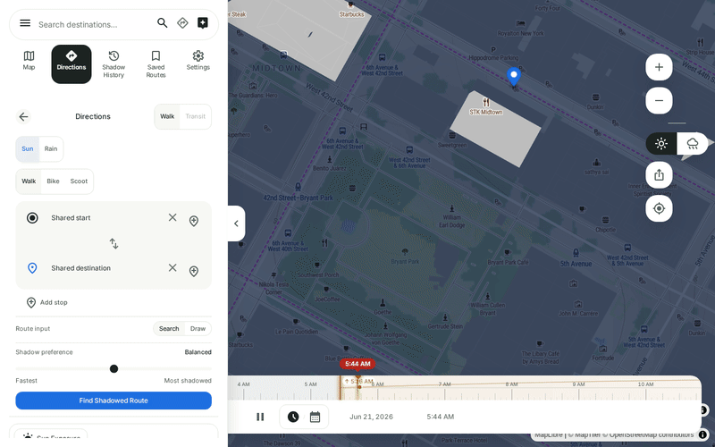
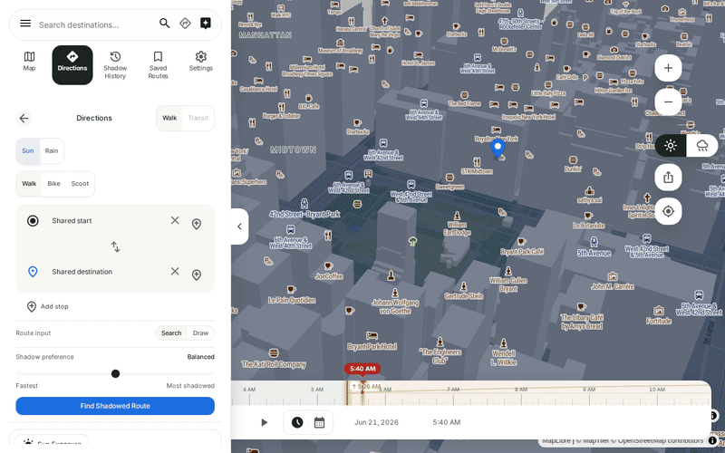
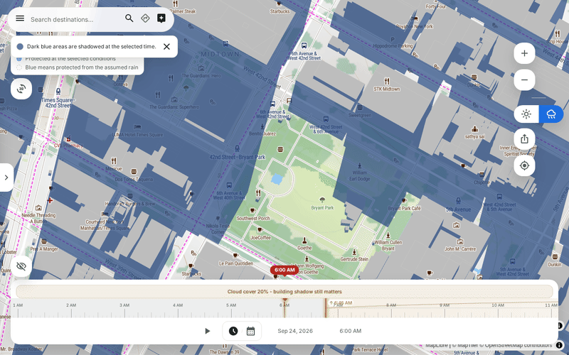

# Umbra

[][ci]

**Shadowed-route navigation for any city on Earth, computed in the browser.** Pick a place and a
time; it puts the sun where it will actually be, casts every building's shadow, and finds a
walking route that stays out of it.



*Midtown Manhattan, 21 June. Dragging the timeline from dawn to morning sweeps every building's
shadow — rendered in WebGL from building geometry — across the map.*

| In 3D | In the rain |
|---|---|
|  |  |
| Tilted, the shadows fall across extruded buildings and still land on the ground under them. | In Rain mode blue means sheltered, and the timeline moves the wind rather than the sun: each hour takes the forecast wind, which slants the rain and moves the dry side of the street. |

## See it work

**[shademapnav.vercel.app][live]** — or open [this exact scene][demo]: Midtown Manhattan,
21 June, 09:00, two waypoints already placed. Press **Find Shadowed Route**, then drag the
timeline and watch both the shadows and the route's shadow percentage move.

That link is not a screenshot. It is the same URL [`e2e/smoke.spec.ts`][smoke] loads on every
pull request, where a real browser asserts that shadows paint, that dragging the timeline moves
them, and that a route calculates.

## Measured, or assumed?

Every number this project has produced is on one page, with its method, its sample counts, its
hardware and its worst case — **[docs/notes/evidence.md](docs/notes/evidence.md)**.

The page also says what is *not* measured, which is a great deal: the routing layer has no
measurement at all, and no figure anywhere in this project compares its shadows to a real one.

Its strongest number is a good example of why the page exists. The geometry model and the pixel
renderer agree to a mean of **2.6 percentage points** across 150 cases — with one sidewalk
reading off by **62.5**, and that worst case is published beside the mean. It is still
**agreement between two of this project's own models, not physical accuracy**, and the page says
so in the same paragraph.

## What it does

- **Shadow-aware walking routes.** A Pareto search over an OSM street graph that trades distance
  against time in the sun, with the tradeoff exposed rather than decided for you.
  ([`app/lib/routing.ts`](app/lib/routing.ts))
- **A real sun and real shadows**, rendered in WebGL from building footprints and heights, for
  any date and time, anywhere vector tiles and OSM reach.
  ([`app/lib/shadow/`](app/lib/shadow/))
- **Transit legs** when the two points are more than 500 m apart. Read
  [evidence.md §5.3](docs/notes/evidence.md#53-transit-figures-mean-something-narrower-than-they-look)
  first — a transit card's minutes, distance and shadow percentage each cover less than the same
  labels do on a walking card. ([`app/lib/trainGraph.ts`](app/lib/trainGraph.ts))
- **Sun-exposure mode** — accumulate shadow across a date range over whatever the map is
  showing, and export the result as a georeferenced GeoTIFF.
  ([`AccumulationPanel.tsx`](app/components/AccumulationPanel.tsx))
- **A rain objective** (experimental): with Rain mode on, walk and bike routes are priced by
  shelter from vertical rain — building overhangs, arcades and tree canopy — and cards report
  dry coverage, wet minutes at your intensity setting, and the model's method
  ([rain-model.md](docs/notes/rain-model.md)). Subway-underground legs are fully sheltered by
  construction.
- **A heat score and a UV dose per route**, both labelled *experimental* in the UI, both with
  their method published: [heat-score.md](docs/notes/heat-score.md),
  [heat-model.md](docs/notes/heat-model.md).
- **A planning assistant** that searches, moves the clock, samples shadow and drops pins on the
  map, with an 18-scenario eval suite over the orchestration.
  ([`app/lib/agent/`](app/lib/agent/))
- Route sketching, saved routes, GeoJSON and GPX export, and a share URL that restores the whole
  scene — which is what the demo link above is.

## What it does not do

Named because the omissions change how much the routes are worth:

- **No trees.** Shadow comes from building geometry only. Consumer apps that model street canopy
  are ahead of this on coverage, not behind it. (`ShadowSource` reserves a `"canopy"` value that
  nothing sets.)
- **The sun does not advance as you walk.** Exposure is priced at one timestamp, not at each
  segment's traversal time. That is the project's central unbuilt idea, not a shipped feature.
- **No optimality claim.** There is no brute-force oracle and no published approximation gap —
  see [evidence.md §2](docs/notes/evidence.md#2-routing).
- **No live-model agent eval.** The agent suite scripts the model's turns and tests the loop's
  decisions; it says nothing about how a live model behaves.
- **No accuracy against reality.** See above, and the page.

## One decision worth explaining

Routing used to read shadow off the map canvas — sample the rendered pixels under a street and
count the blue ones. It worked, and it coupled route quality to the camera: what the user could
see was what routing could measure.

It now samples building geometry directly (`ShadowField`), with the pixel sampler kept as a
per-edge fallback. Making that swap safely needed the disagreement between the two to be a
number rather than an opinion, so [an agreement harness][agreement] measures it across three
city morphologies and CI holds committed ceilings on the mean, the p90 and the severe tail. The
routes now also say [where their shadow number came from][provenance] — building geometry, the
map view, mixed, or unknown — because two routes can report the same percentage on completely
different evidence.

Worth being precise about, since an earlier description of this project got it backwards: this
is a geometry-backed shadow field with a pixel fallback, **not** a pixel sampler.

## Built with

React 19 · TypeScript · Vite · Tailwind v4 · MapLibre GL · a custom WebGL shadow renderer ·
suncalc for solar positions · OSM (Overpass) for streets and footprints · Google Gemini for the
assistant. Everything computes client-side except four thin serverless proxies — place details,
geocoding, Overpass and the assistant — which exist so service keys and required `User-Agent`
headers never reach the browser.

## Running it locally

```bash
cp .env.example .env   # then put your VITE_MAPTILER_API_KEY in it
npm install
npm run dev            # http://localhost:5173
```

A MapTiler key is the only requirement. The other keys in `.env.example` are optional: Foursquare
adds place details, Google Gemini runs the assistant. [`CLAUDE.md`](CLAUDE.md) documents all of them,
including which ones must never reach the browser bundle.

## Repo guide

The repository is self-describing for contributors and coding agents:

- **[`CLAUDE.md`](CLAUDE.md)** — commands, hard invariants, repo map, task→edit-point table.
  Start here.
- **[`.claude/rules/`](.claude/rules/)** — path-scoped rules that load themselves when you open
  a matching file (routing, the shadow renderer, components and the map, external APIs).
- **[`docs/ROADMAP.md`](docs/ROADMAP.md)** — what is being worked on next, and why.
- **[`docs/notes/`](docs/notes/)** — the method pages the app itself links to.

## License

[MIT](LICENSE).

[ci]: https://github.com/marcopolocheung/umbra/actions/workflows/ci.yml
[live]: https://shademapnav.vercel.app/
[demo]: https://shademapnav.vercel.app/?lat=40.754&lng=-73.984&z=17&date=2026-06-21&time=09:00&a=-73.9855,40.753&b=-73.9825,40.755
[smoke]: e2e/smoke.spec.ts
[agreement]: app/lib/shadowField/__tests__/agreement/
[provenance]: app/lib/shadowProvenance.ts
