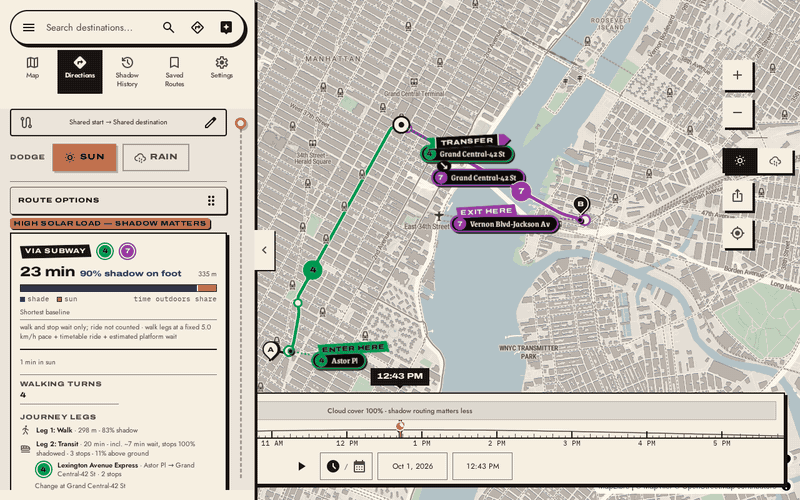

# Umbra

**Shadowed-route navigation, computed in the browser.** Pick a place and a time; it puts the sun
where it will actually be, casts the shadow of every building and tree, and finds a walking route
that stays out of it.



*Astor Place to Long Island City, 1 October. Umbra takes the 4, changes to the 7 at Grand
Central, and scores only the minutes on foot. Dragging the timeline sweeps every shadow across
the walk, and the trip's shade share moves with it.*

More: [in 3D](docs/hero-3d.gif) · [in the rain](docs/hero-rain.gif) ·
[the 43-second tour](docs/tour.mp4)

## Try it

**[shademapnav.vercel.app][live]**, or open [this exact scene][demo]: Midtown Manhattan,
21 June, 09:00, two waypoints already placed. Press **Find the shade**, then drag the timeline
and watch both the shadows and the route's shade percentage move.

That link is also what [`e2e/smoke.spec.ts`][smoke] loads on every pull request, where a real
browser checks that shadows paint, that the timeline moves them, and that a route calculates.

## What it does

- **Shade-aware walking routes.** A Pareto search over the street graph that trades distance
  against time in the sun, and shows the tradeoff instead of picking for you. Each street is
  priced at the moment you would reach it, not at departure, so a route that starts shaded and
  ends in afternoon sun is scored as what it is.
  ([`app/lib/routing.ts`](app/lib/routing.ts), [method](docs/notes/time-aware-routing-h1.md))
- **Shadows from buildings and trees**, rendered in WebGL for any date and time. Buildings come
  from vector tiles and OSM; trees from OSM crowns and Meta/WRI's 1 m canopy-height raster,
  which is also painted on the map. ([`app/lib/shadow/`](app/lib/shadow/),
  [`app/lib/shadowField/`](app/lib/shadowField/))
- **Transit legs** for longer trips, with NYC subway and bus routing on published data. Read
  [evidence.md §5.3](docs/notes/evidence.md#53-transit-figures-mean-something-narrower-than-they-look)
  first: a transit card's minutes, distance and shade percentage cover less than the same labels
  on a walking card. ([`app/lib/trainGraph.ts`](app/lib/trainGraph.ts))
- **Rain mode** (experimental): routes priced by shelter from overhangs, arcades and canopy, with
  the forecast wind slanting the rain. ([method](docs/notes/rain-model.md))
- **A heat score and a UV dose per route**, both labelled experimental in the UI, both with a
  published method: [heat-score.md](docs/notes/heat-score.md),
  [heat-model.md](docs/notes/heat-model.md).
- **Sun-exposure mode**: accumulate shadow over a date range and export it as a georeferenced
  GeoTIFF. ([`AccumulationPanel.tsx`](app/components/AccumulationPanel.tsx))
- **A planning assistant** that searches, sets the clock, samples shadow and drops pins on the
  map. It is held to 36 scripted scenarios and a live-model eval.
  ([`app/lib/agent/`](app/lib/agent/))
- Route sketching, saved routes, GeoJSON and GPX export, and a share URL that restores the whole
  scene (the demo link above is one).

## How good is it?

Every number the project has produced is on one page, with its method, its sample size and its
worst case: **[docs/notes/evidence.md](docs/notes/evidence.md)**. The headline four:

| What was checked | Result | What it does not say | Source |
|---|---|---|---|
| Shade vs NYC LiDAR, 8 blocks × 3 dates × 5 hours | **34.7 pp** mean error per sidewalk segment; trees are the largest miss | Geometry against geometry, not a person standing in the sun | [shade-accuracy](docs/notes/shade-accuracy.md) |
| Geometry field vs pixel renderer, 150 cases | **2.6 pp** mean, **62.5 pp** worst; CI holds the ceilings | Two of Umbra's own models agreeing, not accuracy | [harness][agreement] |
| Route search vs brute-force oracle | Exact on static fixtures; time-aware, **2 s (3.6%)** off the best | Small fixtures only, no bound on a real city graph | [sun-budget-model](docs/notes/sun-budget-model.md) |
| Assistant on a live Gemini model | **25 / 25** scenarios grounded | One run, stubbed tools; grades grounding, not plan quality | [agent-live-eval](docs/notes/agent-live-eval-2026-09-11.md) |

Every route also says where its shade figure came from — building geometry, the map view, a mix,
or nothing — because two routes can show the same percentage on very different evidence
([`shadowProvenance.ts`][provenance]).

Not measured: accuracy against real, observed shadows; how the search's gap grows on a real
city graph; browser latency budgets.

## Run it locally

```bash
cp .env.example .env   # then set VITE_MAPTILER_API_KEY
npm install
npm run dev            # http://localhost:5173
```

A MapTiler key is the only requirement. Foursquare adds place details and Google Gemini runs the
assistant; [`.env.example`](.env.example) explains each key and which ones must never reach the
browser.

Built with React 19, TypeScript, Vite, Tailwind v4, MapLibre GL, a custom WebGL shadow renderer
and suncalc. Everything runs client-side except four small serverless proxies (place details,
geocoding, Overpass and the assistant), which keep service keys and `User-Agent` headers off the
browser.

## Contributing

[`.claude/CLAUDE.md`](.claude/CLAUDE.md) has the commands, the hard invariants and where to edit what.
[`docs/ROADMAP.md`](docs/ROADMAP.md) says what is next and why.

## License

[MIT](LICENSE).

[live]: https://shademapnav.vercel.app/
[demo]: https://shademapnav.vercel.app/?lat=40.754&lng=-73.984&z=17&date=2026-06-21&time=09:00&a=-73.9855,40.753&b=-73.9825,40.755
[smoke]: e2e/smoke.spec.ts
[agreement]: app/lib/shadowField/__tests__/agreement/
[provenance]: app/lib/shadowProvenance.ts
